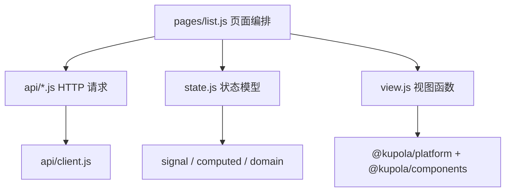
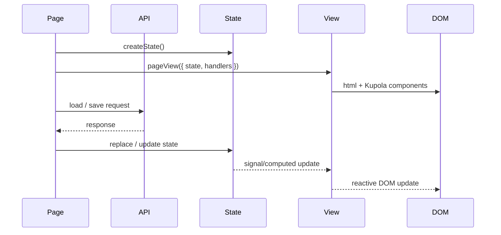

# 业务页面分层

Vite 只解决模块构建和开发服务器问题，Kupola 也不会强制规定业务代码的目录结构。
对于 kupola-app 这类包含列表、筛选、表单、权限和异步请求的管理后台，推荐把一个业务
页面拆成 `pages/*.js`、`view.js` 和 `state.js` 三层，再把 HTTP 请求放在独立的
`api/` 模块中。

## 三层职责

| 层 | kupola-app 位置 | 负责什么 | 不负责什么 |
| --- | --- | --- | --- |
| 页面编排 | `features/<feature>/pages/list.js` | 创建状态、调用 API、权限判断、组装回调、打开浮层、返回页面视图 | 不承载大段 HTML 结构和复杂派生状态 |
| 视图 | `features/<feature>/view.js` | 返回 `html` 模板、组合 Kupola 组件、绑定输入和回调、展示状态 | 不发 HTTP 请求、不创建页面级状态、不决定业务权限 |
| 状态 | `features/<feature>/state.js` | `signal`、`computed`、数据规范化、筛选、选择、草稿和状态转换 | 不查询 DOM、不打开浮层、不显示消息 |

HTTP 请求放在 `features/<feature>/api.js` 或共享的 `src/api/` 中，由页面层调用；
跨页面的领域常量和规范化函数放在 `src/domain/`。这样可以让状态测试和视图测试
不依赖真实后端。

## 依赖方向



推荐保持单向依赖：

- `pages/*.js` 可以依赖 `api`、`state`、`view`、鉴权和浮层服务。
- `view.js` 可以消费传入的 state 和回调，但不依赖 API 和页面编排。
- `state.js` 依赖 Kupola 响应式 API 和领域规则，但不依赖 DOM 和组件。
- `api/*.js` 只处理请求、响应和错误协议，不修改页面 state。

## 页面编排层

页面文件是路由加载的入口，也是业务副作用的边界。它创建本次进入页面专属的 state，
调用后端接口，将结果写入 state，再把事件处理函数传给 view：

```js
import { Message } from '@kupola/components/message'
import { listDevices, updateDevice } from '../../../api/devices.js'
import { createDeviceState } from '../state.js'
import { deviceListPageView } from '../view.js'

export default function DeviceListPage() {
  const state = createDeviceState()
  const feedback = Message({ maxCount: 3 })

  async function loadData() {
    try {
      state.replaceDevices(await listDevices({ limit: 1000, status: 'all' }))
    } catch (error) {
      feedback.error('设备数据加载失败，请稍后重试。')
    }
  }

  void loadData()

  async function handleSave(deviceId, input) {
    const updated = await updateDevice(deviceId, input)
    state.updateDevice(deviceId, updated)
  }

  return deviceListPageView({ state, onSave: handleSave })
}
```

页面层可以组合 `useAuth()`、`useOverlay()`、`Dialog` 和 `Message`，但应把这些能力
转换成回调传给 view。这样视图只知道“发生了什么操作”，不需要知道请求地址或权限
来源。

## 状态层

状态工厂为每次页面进入创建独立实例，避免列表筛选、当前选中项或表单草稿泄漏到
其他路由。它暴露原始 signal、派生 computed 和明确的变更方法：

```js
import { computed, signal } from '@kupola/platform'

export function createDeviceState(initialDevices = []) {
  const devices = signal(initialDevices)
  const keyword = signal('')

  const filteredDevices = computed(() => {
    const query = keyword.value.trim().toLowerCase()
    return query
      ? devices.value.filter(item => item.deviceNo.toLowerCase().includes(query))
      : devices.value
  })

  function setKeyword(value) {
    keyword.value = String(value || '')
  }

  function replaceDevices(nextDevices) {
    devices.value = Array.isArray(nextDevices) ? nextDevices : []
  }

  return { devices, keyword, filteredDevices, setKeyword, replaceDevices }
}
```

状态方法应负责不变量和规范化，例如过滤器合法性、集合去重、草稿重置和本地数据
转换。不要让 view 直接修改 `signal.value`，除非这是非常简单且明确的展示状态；业务
状态优先通过命名方法修改。

## 视图层

视图函数接收 state 和事件回调，返回 Kupola `html` 模板。复杂视图可以继续拆成
`toolbarView`、`tableView`、`formView` 等局部函数，但不要把请求和权限流程放进来：

```js
import { html } from '@kupola/platform'
import { Panel } from '@kupola/components/panel'

export function deviceListPageView({ state, onSave }) {
  return html`
    ${Panel({ title: '设备管理' }, html`
      <input
        value="${state.keyword}"
        oninput="${event => state.setKeyword(event.target.value)}"
        placeholder="搜索设备"
      />
      <button type="button" onclick="${() => onSave(/* 页面数据 */)}">保存</button>
      <div class="device-list">
        ${() => state.filteredDevices.value.map(device => html`
          <div>${device.deviceNo}</div>
        `)}
      </div>
    `)}
  `
}
```

实际项目中，view 可以接收整个 state，也可以接收更窄的 view model。页面越复杂，越
推荐用参数对象明确列出依赖，例如 `items`、`stats`、`onSearch`、`onSelect`、`onSave`。

## 数据流和生命周期



页面进入时创建 state，离开时由路由和根组件销毁视图。页面自己创建的临时实例必须
负责销毁：

- `Message()`、`useOverlay()` 打开的临时消息和浮层，在关闭或页面退出时清理。
- `setInterval`、原生 `addEventListener`、AbortController 等副作用必须有对应清理。
- 组件实例不再使用时调用 `instance.destroy()`；应用根实例使用 `app.destroy()` 或
  `app.destroyAsync()`。

## 什么时候不需要三层

这不是每个页面的最低要求：

- 只有静态内容或一个很小的交互，可以直接使用 `Page.js` 返回 `html`。
- 没有本地派生状态的简单弹窗，可以由页面直接调用组件。
- 一旦出现异步加载、列表筛选、多个操作回调、表单草稿或权限分支，就应拆出
  `state.js` 和 `view.js`。

因此，kupola-app 应把 `pages/*.js + view.js + state.js` 作为复杂业务页面的默认模板，
而不是把这套目录约定误认为 Kupola 组件库的强制 API。
